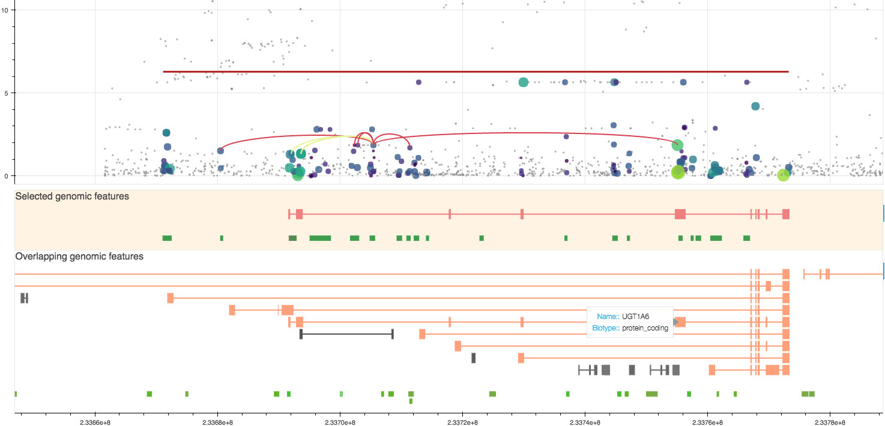

# PlotBurden : an interactive tool for visualising results of rare variant burden associations

> Update: `plotburden` should now be compatible with the latest version of bokeh. We have transitioned it to a bokeh server application (see below for details), which makes it a bit harder to use (but not too much). **`plotburden` is now compatible with meta-analyses performed using SMMAT**. It has been tested on outputs of our [containerised rare variant association pipeline](https://github.com/hmgu-itg/burden_testing).

This tool is aimed at helping researchers explore the results of their gene-based burden testing analyses. It links together results from a burden test, single point association data at the locus and online resources in a single customisable interactive plot. It connects to Ensembl to fetch relevant information about the variants (MAF, rsIDs) and the functional context (overlapping regulatory or genic features, prior evidence of association...). More precisely, it can help answer the following questions:
* Which variants drive my burden?
* Which variants are up/down-weighted?
* What is the LD structure between my variants? 
* Is the burden really driven by a single point signal?
* Do any of the variants recapitulate existing single-point associations?
* Are the driver variants intronic, exonic or regulatory?

## Example
An image speaks better than a thousand words:

The interactive version can be found [here](http://rawgit.com/wtsi-team144/plotburden/master/example.html).

## Prerequisites
In order to run this software you need to have working copies of the following tools installed:
* Plink 1.9 or newer ([available here](https://www.cog-genomics.org/plink2/index))
* Tabix ([available as part of bcftools/htslib](http://www.htslib.org/download/))

### Python libraries
* `pandas`
* `numpy`
* `bokeh`
* `pybedtools`
* `requests`
* `urllib` (`urllib.request` and `urllib.parse`)


## Installation
Hopefully, this tool should work quasi out-of-the-box. It **needs `tabix` and `plink` to be in your path**, since it calls these directly from inside the script. This is done like:

```bash
export PATH=/path/to/tabix:/path/to/plink:$PATH
```

If you want to make these changes permanent, do:
```bash
echo 'export PATH=/path/to/tabix:/path/to/plink:$PATH' >> ~/.bashrc
```

## Input
So far, the program works only with the output of [GEMMA](http://www.xzlab.org/software.html) for the single-point data and [MONSTER](https://www.stat.uchicago.edu/~mcpeek/software/MONSTER/index.html) for burden testing. Compatibility with more tools can be provided upon request.

## Usage for single cohorts using MONSTER

> Warning: since development has shifted towards the meta-analysis version, some parts of the original single-cohort code may be broken.

**Warning** all arguments are required and positional.

```bash
./plotburden.sh [gene_name] [input_monster] [output_monster] [sp_results] [vcf] [window] [output]
```
* **gene_name** is the name of the gene (e.g. _CETP_).
* **input_monster** is the location of the variant file that is given to MONSTER as input.
* **output_monster** : location of the output of the MONSTER run.
* **sp_results** : location of the single-point results file. Expected to be **bgzipped and tabixed**.
* **vcf** : VCF containing source variants. Used for LD calculation.
* **window** : Window, in base pairs, to extend gene boundaries by. If this is too large, the program will be very, very slow. We have experienced good results with 30kb.
* **output** : output file in html format.

### Usage for SMMAT

You will first need to generate a binary file that contains plot data, then pass that file to a visualisation script. This is easily automated in a script with your own data paths. In the following documentation, the script takes information from _i_ cohorts, plus the meta-analysis.

#### Calculating plot data

```bash
calculate_plot.py [phenotype_name] [gene_name] [condition] [variant_set_file] \
                  single_cohort_RV_results_file_0[,single_cohort_RV_results_file_1[,...]]],meta_analysis_RV_results_file cohort_name_0[,cohort_name_1[,...]] \
                  single_cohort_SP_results_file_0[,single_cohort_SP_results_file_1[,...]]],meta_analysis_SP_results_file \
                  single_cohort_VCF_0[,single_cohort_VCF_1[,...]] \
                  [window] [output] [linked_features] [chopping]
```

* **phenotype_name** the phenotype name used in the rare variant output files (e.g. _LDL_).
* **gene_name** is the name of the gene (e.g. _CETP_). This will be converted to ENSG ids via an API call to Ensembl, so has to be recognizable and mappable by it.
* **condition** variant selection method used when performing burden tests (The script expects to find variant sets named _ENSGXXX.condition_ in the set file, where _ENSGXXX_ maps to `gene_symbol` in Ensembl, see section "Input" below).
* **variant_set_file** variant set file used for burden testing. It can contain all genes (study wide) or just the gene/condition you are interested in. It should be of the form `set_name\tchr\tpos\tallele1\tallele2\tweight` (no header).
* **single_cohort_RV_results_file_i** : results of burden associations in each cohort, separately. It should be tab delimited, optionally gzipped, with the following columns : `"gene","pheno","condition","symbol","O_minp"`.
* **meta_analysis_RV_results_file** : results of burden association meta-analysis. It should be tab delimited, optionally gzipped, with the following columns : `"gene","pheno","group","symbol","O_minp"`. `group` here is equivalent to `condition` above.
* **single_cohort_SP_results_file_i** : As above, for single-point association. Expected to be **bgzipped and tabixed**, GEMMA and GCTA outputs are supported.
* **meta_analysis_SP_results_file** : As above, for single-point association. METAL output is supported.
* **single_cohort_VCF_i** : Single-cohort VCF containing SNP information for all SNPs included in **variant_set_file** and **single_cohort_SP_results_file_i**, SNPs are not required to be named identically, since matching is done per position. Can be single-chromosome, region-based or whole-genome. Used for LD calculation.
* **window** : Window, in base pairs, to extend gene boundaries by. If this is too large, the program will be very, very slow. We have experienced good results with 30kb.
* **output** : output file in html format.
* **linked_features** : linked features file generated by our [containerised rare variant association pipeline](https://github.com/hmgu-itg/burden_testing).
* **chopping**: please set this to `False`

#### Visualising the plot

The above step will generate a `.bin` document containing plot data. **This has to be run on a machine where you either can run a browser, or one that you can access via a network**. This file is read by the second script:

```bash
bokeh serve --port [port_number] display_plot.py --args [binfile]
```

* **port_number** local port to serve the plot on. If you don't know what to put there, use any number above 10000.
* **binfile** The file generated in the step above.

Then go to the address `http://hostname:port_number/display_plot`. `hostname` is `localhost` if you are opening a browser on the same machine the server is running on, or the name of the machine otherwise. If this does not work, the port may be blocked or the network configuration may prevent you from serving webpages. In that case, contact your sysadmin or run this on your own machine.

## Genome build
The program is currently only compatible with build 38 (GRCh38) of the human genome. Compatibility with b37 can be provided upon request.
